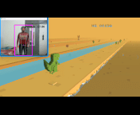
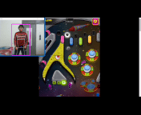
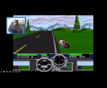

# GTA 5 Hand Gesture Control

This project allows you to control **GTA 5** using hand gestures. The code was originally written two years ago, so it is recommended to use **Python 3.11** for compatibility. For environment management, we suggest using [astral-uv](https://github.com/astral-uv/astral-uv).

## Setup

1. Create and activate a virtual environment:

   ```bash
   uv venv
   ```
2. Synchronize dependencies:

   ```bash
   uv sync
   ```
3. Run the main script:

   ```bash
   uv run main.py
   ```

## Other Game Demos

This repository also contains gesture-controlled scripts for other games. You can explore them in the [old branch](https://github.com/arpy8/mediapipe-scripts/tree/old).

| Chrome Dino Demo                                 | Motor Driver Demo                                 |
| ------------------------------------------------ | ------------------------------------------------- |
|  |  |

| Pin Ball Demo                              | Road Rage Demo                               |
| ------------------------------------------ | -------------------------------------------- |
|  |  |